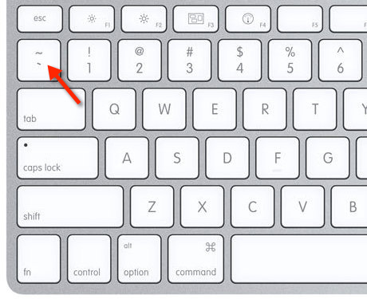

# github-docs-example
## Step 1 - How to take screenshots

A screenshot is when you capture a part of your screen from your laptop, desktop, or phone. 

This is not to be confused with taking a photo with your phone.

**DON'T DO THIS**


Do this instead.


## Step 2 - Using Codeblocks.

Codeblocks in markdown make it *very easy* for tech people to **copy, paste, share** code.
A good __Cloud Engineer__ uses Codeblocks whenever possible.

Because it allows others to copy and paste their code to replcate or research issues.

In order to create codeblocks in markdown you need to use three backticks (`) 
Not to be confused with single quotation (')

```
def factorial(n):
    if n == 0:
        return 1
    else:
        return n * factorial(n - 1)

try:
    number = int(input("Enter a number to calculate its factorial: "))
    if number < 0:
        print("Factorial is not defined for negative numbers.")
    else:
        result = factorial(number)
        print(f"The factorial of {number} is {result}.")
except ValueError:
    print("Invalid input. Please enter a valid integer.")
```

When you can you should attempt to apply syntax highlighting to your codeblocks. This is done by simply adding the name of the language following the three backticks. (```*name of language*).

```Python
def factorial(n):
    if n == 0:
        return 1
    else:
        return n * factorial(n - 1)

try:
    number = int(input("Enter a number to calculate its factorial: "))
    if number < 0:
        print("Factorial is not defined for negative numbers.")
    else:
        result = factorial(number)
        print(f"The factorial of {number} is {result}.")
except ValueError:
    print("Invalid input. Please enter a valid integer.")
```
-Make note of where the backtick keyboard key is located.

-It should appear above the tab key, but it may vary based on your keyboard layout.



-Good Cloud Engineers use codeblocks for both code and errors that appear in the console.


```bash
Enter an integer: abc
Error: invalid literal for int() with base 10: 'abc'
```
>Here is an example of using a codeblock for an error that appears in bash.

## Step 3 - Use Github Flavored Task Lists

Github extends markdown to have a list where you can check off items. [<sup>[3]</sup>](#references)

- [x] Finish Step 1
- [x] Finish Step 2
- [x] Finish Step 3
- [x] Finish Step 4
- [x] Finish Step 5

# Step 4- Use Emojis (Optional)

Github Flavored Markdown (GFM) supports emoji shorcuts. [<sup>[4]</sup>](#references)

Here are some examples:

| Name | Shortcode | Emoji |
| --- | --- | --- |
| Cloud | `:cloud:` | ☁️ |
| Cloud | `:cloud_with_lightning` | 🌩️ |
| Cloud | `:cloud_with_lightning_and_rain:` | ⛈️ |
| Cloud | `:cloud_with_snow:` | 🌨️ |

# Step 5 - How to create a table

You can use the following markdown format to create tables:


```MD
| Name | Shortcode | Emoji |
| --- | --- | --- |
| Cloud | `:cloud:` | ☁️ |
| Cloud | `:cloud_with_lightning` | 🌩️ |
| Cloud | `:cloud_with_lightning_and_rain:` | ⛈️ |
| Cloud | `:cloud_with_snow:` | 🌨️ |
```

Gthub extends the functionality of Markdown taables to provide more alignment and table cell formatting options. <sup>5</sup>

-Make note of where the pipe keyboard key is located.

-It should appear above the enter key, but it may vary based on your keyboard layout.


[Secret Window Hidden Garden](Secret-Window/Hidden-Garden.md)

## References

-[Github Flavored Markdown Spec](https://github.github.com/gfm/) <sup> [1]</sup>

-[Getting Started with Github Markdown](https://docs.github.com/en/get-started/writing-on-github/getting-started-with-writing-and-formatting-on-github/basic-writing-and-formatting-syntax#quoting-code) <sup> [2]</sup>

-[GFM - tasks Lists](https://docs.github.com/en/get-started/writing-on-github/getting-started-with-writing-and-formatting-on-github/basic-writing-and-formatting-syntax#task-lists) <sup>[3]</sup>

-[GFM Emoji Cheatsheet](https://github.com/ikatyang/emoji-cheat-sheet) <sup>[4]</sup>

[GFM - Tables (extensions)](https://github.github.com/gfm/#tables-extension-)<sup>[5]</sup>
